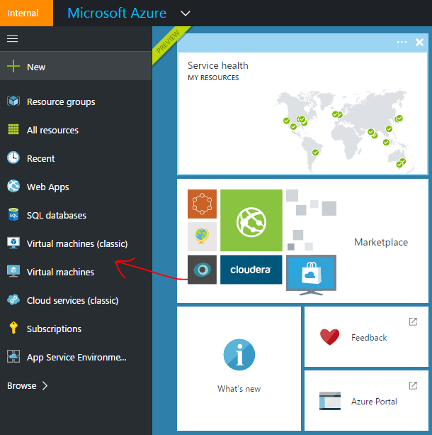

#Open Azure endpoint
Azure has a built-in firewall, so if you need to communicate on a specific port; port-forwarding is required (NAT).

1. Find you VM instance either through the dashboard (if you have pinned it) or via the Virtual Machine short cut.

	There are two types of VMs classic and 'normal' meaning the new Azure Ressource Manager (ARM) based.
	
	
	
2. Select the VM you want to add new port-forwarding.

	
	
3. Select **Endpoints** menu

	If the right panel has not appeared select the **All settings*

	

4. Add a new endpoint

	
	
5. Fill in the name, public and private port.