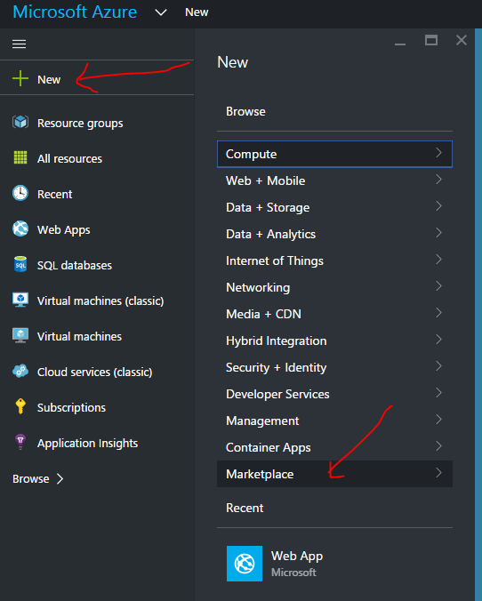
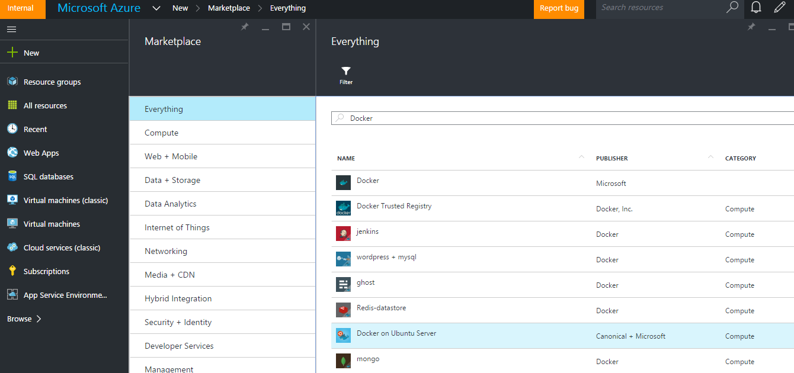
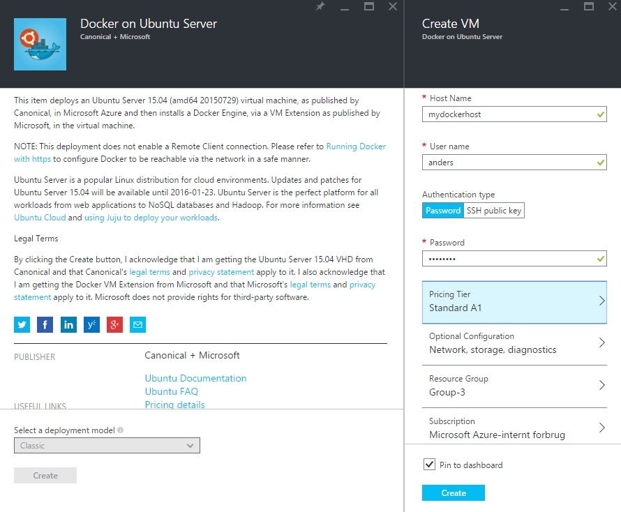

#Setup Docker host on Azure
There are multiple ways of provisioning a Linux-based Docker host.

1. Install a [Linux OS on a virtual machine and install Docker](http://docs.docker.com/engine/installation/ubuntulinux/)
2. Use a [pre-existing Linux image from Azure and install Docker](https://azure.microsoft.com/en-us/documentation/articles/virtual-machines-docker-with-portal/)
3. Spin-up an already existing Docker image from the Azure Marketplace

During these exercises we will use the Docker image from the Azure Marketplace.

1. Login to the [Azure Preview portal](https://portal.azure.com)
2. Create a new Marketplace image 

 
3. Search for 'Docker' and select 'Docker on Ubuntu Server'
 

 
4. Fill in the VM information
 
