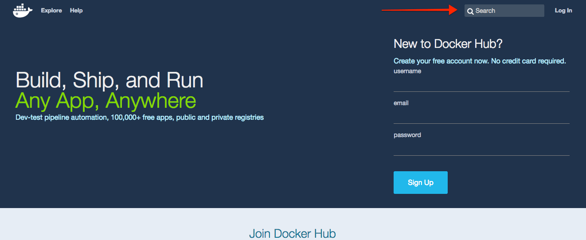
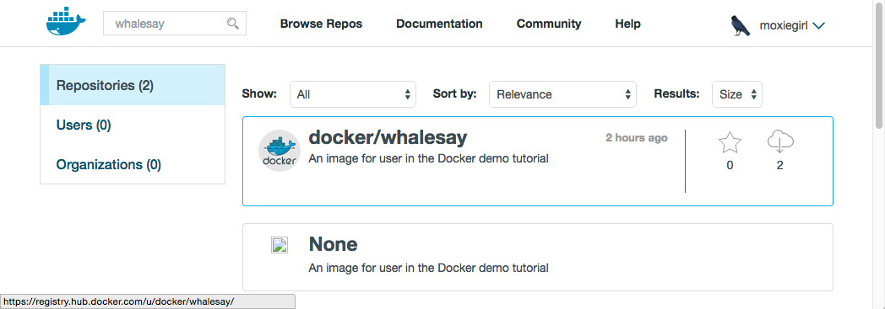
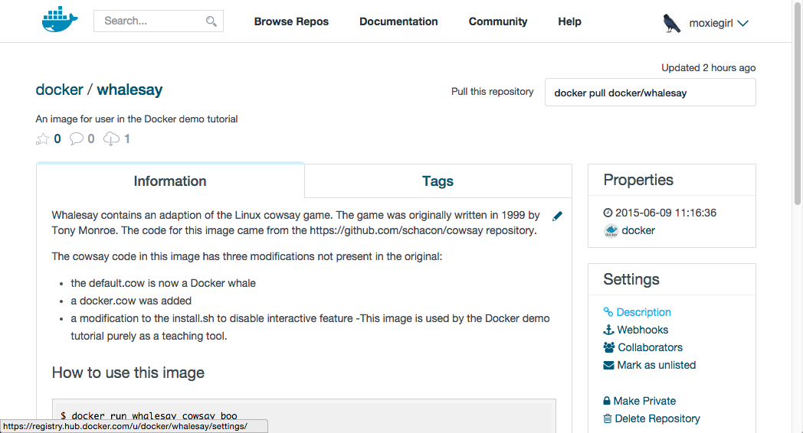

#Docker Hub - the 'whalesay' image

1. Open your browser and [browse to the Docker Hub.](https://hub.docker.com/)
 
	
	 
	The Docker Hub contains images from individuals like you and official images from organizations like RedHat, IBM, Google, and a whole lot more.

2. Click Browse & Search.

	The browser opens the search page.

3. Enter the word whalesay in the search bar.

	

4. Click on the docker/whalesay image in the results.

	The browser displays the repository for the whalesay image.
	
	

	Each image repository contains information about an image. It should include information such as what kind of software the image contains and how to use it. You may notice that the whalesay image is based on a Linux distribution called Ubuntu. In the next step, you run the whalesay image on your machine.

5. Open SSH tunnel to your Docker host 

6. Type the docker run docker/whalesay cowsay boo command and press RETURN.

	This command runs the whalesay image in a container. Your terminal should look like the following:
 
	```
	$ docker run docker/whalesay cowsay boo
	Unable to find image 'docker/whalesay:latest' locally
	latest: Pulling from docker/whalesay
	e9e06b06e14c: Pull complete
	a82efea989f9: Pull complete
	37bea4ee0c81: Pull complete
	07f8e8c5e660: Pull complete
	676c4a1897e6: Pull complete
	5b74edbcaa5b: Pull complete
	1722f41ddcb5: Pull complete
	99da72cfe067: Pull complete
	5d5bd9951e26: Pull complete
	fb434121fc77: Already exists
	Digest: sha256:d6ee73f978a366cf97974115abe9c4099ed59c6f75c23d03c64446bb9cd49163
	Status: Downloaded newer image for docker/whalesay:latest
	_____
	< boo >
	-----
		\
		\
		\     
						##        .            
				## ## ##       ==            
			## ## ## ##      ===            
		/""""""""""""""""___/ ===        
	~~~ {~~ ~~~~ ~~~ ~~~~ ~~ ~ /  ===- ~~~   
		\______ o          __/            
			\    \        __/             
			\____\______/   
	```
	The first time you run a software image, the docker command looks for it on your local system. If the image isn’t there, then docker gets it from the hub.

7. While still in the Docker Quickstart Terminal, type docker images command and press RETURN.

	The command lists all the images on your local system. You should see docker/whalesay in the list.
	```
	$ docker images
	REPOSITORY           TAG         IMAGE ID            CREATED            VIRTUAL SIZE
	docker/whalesay      latest      fb434121fc77        3 hours ago        247 MB
	hello-world          latest      91c95931e552        5 weeks ago        910 B
	```
	When you run an image in a container, Docker downloads the image to your computer. This local copy of the image saves you time. Docker only downloads the image again if the image’s source changes on the hub. You can, of course, delete the image yourself. You’ll learn more about that later. Let’s leave the image there for now because we are going to use it later.

8. Take a moment to play with the whalesay container a bit.
	Try running the whalesay image again with a word or phrase. Try a long or short phrase. Can you break the cow?
	```
	$ docker run docker/whalesay cowsay boo-boo _________ < boo-boo > ——— \ \ \
	## .
	## ## ## ==
	## ## ## ## ===
	/“”“”“”“”“”“”“”“”/ ===
	~~~ {~~ ~~~~ ~~~ ~~~~ ~~ ~ / ===- ~~~
	___ o /
	\ \ __/
	____/
	```
