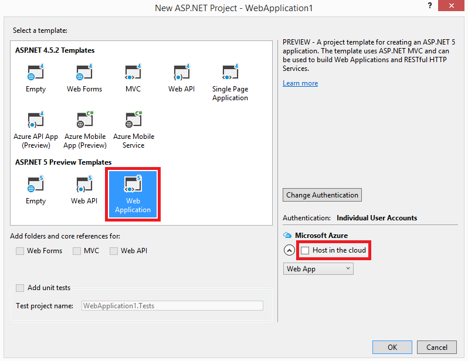
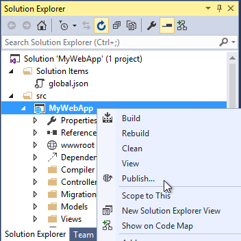
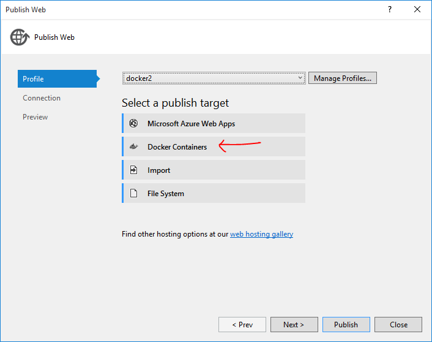
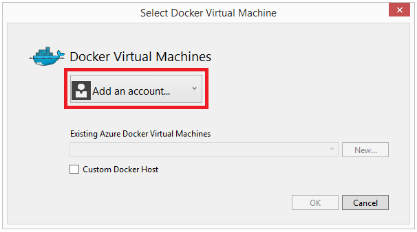
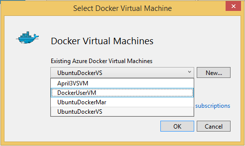
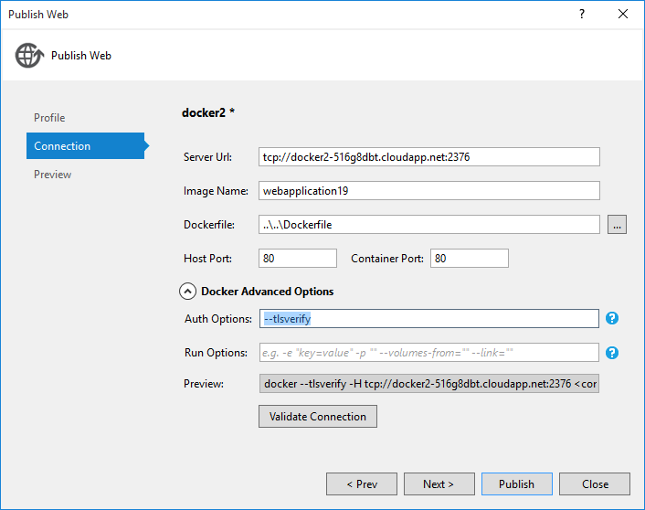

#Visual Studio 2015 Docker extension

If you have Visual Studio 2015 installed you can utilize the new Docker extension, which is available in the [Visual Studio Gallery](https://visualstudiogallery.msdn.microsoft.com/0f5b2caa-ea00-41c8-b8a2-058c7da0b3e4)

From the Visual Studio Gallery the extension is described as follows: 
>The Visual Studio 2015 Tools for Docker Preview enables developers to build and publish an ASP.NET 5 Web or console application to a Docker container running on a Linux virtual machine.

>The Visual Studio 2015 Docker extension requires the [Microsoft ASP.NET and Web Tools 2015](https://www.microsoft.com/en-us/download/details.aspx?id=49442) to be installed.

##Docker daemon

To be able to remote-control you Docker host you must start the [Docker daemon](http://docs.docker.com/engine/articles/configuring/).
The Docker daemon allow you to use the Docker CLI tools from another machine.

By default, the docker daemon will use the unix socket `unix:///var/run/docker.sock` (you can check this is the case for you by doing a `sudo netstat -tunlp` and note that there is no docker daemon process listening on any ports). 
To start the docker daemon with a TCP socket that anybody can connect to, use the -H option
```
sudo docker -H tcp://0.0.0.0:2376 -H unix:///var/run/docker.sock -d &
```
>This is *not* the recommended approach as anybody can connect to your Docker daemon and manage your containers. See the [protect the Docker daemon socket](http://docs.docker.com/engine/articles/https/). 

## Create an ASP.NET 5 web application project
1. Create a new ASP.NET web application project. On the main menu, choose **File**, **New Project**. Under **C#**, **Web**, choose **ASP.NET Web Application**.

1. In the list of **ASP.NET 5 Preview Templates**, choose **Web Site**.

1. Since the web app will be hosted/run in Docker, clear the **Host in the cloud** checkbox if it's selected and then choose the **OK** button.

  

  This is the point where you'd typically add code to the web app to make it do something useful, but for this example, let's just leave it at its default settings. (Note that you can also choose to use existing ASP.NET 5 web apps.)

##Deploy ASP.NET 5 website to a Docker container

1. On the ASP.NET project's context menu, choose **Publish**.

	

2. In the **Select a publish target** section of the **Publish Web** dialog box, choose the **Docker Containers** button.

	

3. If you're already logged into an Azure account, skip to step 5. If you're not logged into an account, choose the **Add an account** button.

	

4. In the **Sign in to Visual Studio** dialog box, enter the email account for your Azure subscription and then choose the **Continue** button.

5. Choose existing Docker host.

	

6. If your Docker daemon is not secure, then remove the `--tlsverify`

	 

7. Test the connection to the Docker daemon by pressing **Validate connection**.

8. Press **Publish**, and follow along in the build output.

