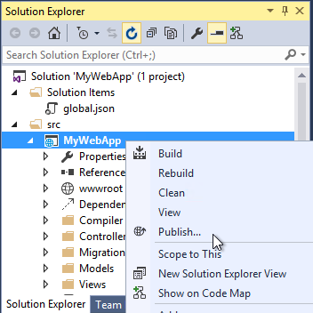

#Visual Studio 2015 Docker extension

If you have Visual Studio 2015 installed you can utilize the new Docker extension, which is available in the [Visual Studio Gallery](https://visualstudiogallery.msdn.microsoft.com/0f5b2caa-ea00-41c8-b8a2-058c7da0b3e4)

From the Visual Studio Gallery the extension is described as follows: 
>The Visual Studio 2015 Tools for Docker Preview enables developers to build and publish an ASP.NET 5 Web or console application to a Docker container running on a Linux virtual machine.

>The Visual Studio 2015 Docker extension requires the [Microsoft ASP.NET and Web Tools 2015](https://www.microsoft.com/en-us/download/details.aspx?id=49442) to be installed.

So basically, you just install the extension, create a new ASP.NET 5 site using the built-in template.
Right-click Publish to get the publishing dialog, which allows us to pick Docker as the way to Publish.

If you want to use an existing virtual machine you can choose one after having signed into your Azure account.

Once you have finished the configuration of the "Publish to Docker" you can publish your web app, and follow along in the build output.

There is really not more to it. But of course its a different way of publishing a web app or console app to Docker.
