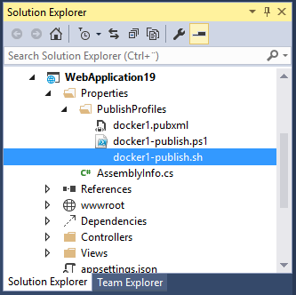

#Deploy via Windows CLI

>This exercise required the Visual Studio 2015 Docker Extension. We will continue with the ASP.NET 5 web application created in exercise 5.

1. Open the Developler Command Prompt

2. Type ```docker info```

	You will see that we need to specify which Docker host to connect to.

3. Get the Docker host url from either the Visual Studio Docker Extension or via the Azure portal.
4. Set the default host in the Developer Command Prompt
	```
	set docker_host=tcp://mydockerhost.cloudapp.net:2376
	```
5. Now you can user the Windows Docker CLI
	´´´
	docker info
	´´´
	>if you are using a secure connection to the Docker daemon you need to specify the ```--tls``` too.
	
	Now you can use all the Docker CLI commands like
	```
	docker ps
	docker images
	```
6. Build and publish
	We will use the publish settings file (.pubxml).
	
	
	
	With content similar to below.
	```xml
	<?xml version="1.0" encoding="utf-8"?>
	<!--
	This file is used by the publish/package process of your Web project. You can customize the behavior of this process
	by editing this MSBuild file. In order to learn more about this please visit http://go.microsoft.com/fwlink/?LinkID=208121. 
	-->
	<Project ToolsVersion="4.0" xmlns="http://schemas.microsoft.com/developer/msbuild/2003">
	<PropertyGroup>
		<WebPublishMethod>Docker</WebPublishMethod>
		<LastUsedBuildConfiguration>Release</LastUsedBuildConfiguration>
		<LastUsedPlatform>Any CPU</LastUsedPlatform>
		<SiteUrlToLaunchAfterPublish />
		<LaunchSiteAfterPublish>True</LaunchSiteAfterPublish>
		<ExcludeApp_Data>False</ExcludeApp_Data>
		<CompileSource>False</CompileSource>
		<_DefaultDNXVersion>dnx-clr-win-x86.1.0.0-beta8</_DefaultDNXVersion>
		<UsePowerShell>True</UsePowerShell>
		<IISCommand>web</IISCommand>
		<WebRoot>wwwroot</WebRoot>
		<WwwRootOut>wwwroot</WwwRootOut>
		<IncludeSymbols>False</IncludeSymbols>
		<Native>False</Native>
		<IgnoreDNXRuntime>True</IgnoreDNXRuntime>
		<DockerServerUrl>tcp://docker1-243kj165.cloudapp.net:2376</DockerServerUrl>
		<DockerImageName>alydotnet5</DockerImageName>
		<DockerfileRelativePath>..\..\Dockerfile</DockerfileRelativePath>
		<DockerPublishHostPort>80</DockerPublishHostPort>
		<DockerPublishContainerPort>80</DockerPublishContainerPort>
		<DockerAuthOptions />
		<DockerRunOptions />
		<DockerAppType>Web</DockerAppType>
		<DockerBuildOnly>False</DockerBuildOnly>
		<DockerRemoveConflictingContainers>True</DockerRemoveConflictingContainers>
	</PropertyGroup>
	</Project>
	```

	Run the below command. It will build the solution and push the Docker image to your Docker host.

	```
	msbuild WebApplication19.xproj /p:deployOnBuild=true;publishProfile="c:\mypath\WebApplication19\Properties\PublishProfiles\docker1.pubxml"
	```