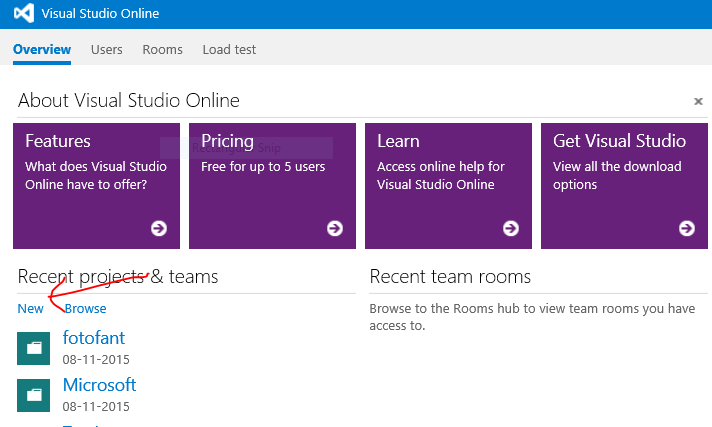
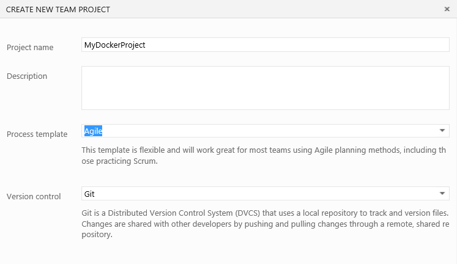
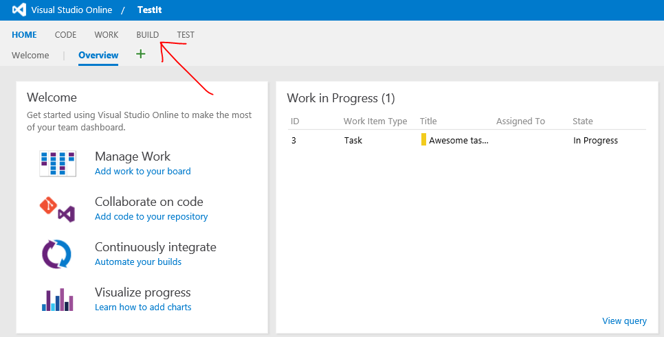
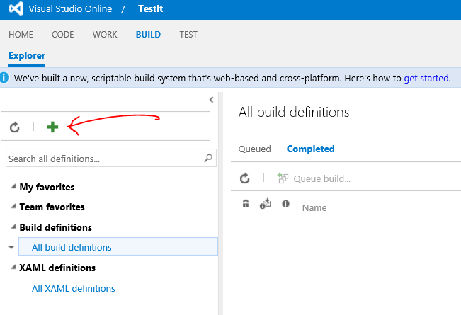

#Continuous deploy via Visual Studio Online Build
[Visual Studio Online](https://www.visualstudio.com/en-us/products/what-is-visual-studio-online-vs.aspx) (VSO) is a free source repository with private repositories using either Git or TFVC, and a hole lot more.

In this exercise we are using the VSO Build feature, but you can choose to use Github, Bitbucket or any other source repository.

[Sign-up for VSO](https://www.visualstudio.com/en-us/products/what-is-visual-studio-online-vs.aspx) if you do not already have an account.

1. Sign-in to your VSO account e.g. `accountname.visualstudio.com`

2. Create a new Team Project

	
	
3. Enter project name and select source repository type

	
	
4. Select the **Build** menu

	

5. Create new build definition (do not select XAML Build defintions as they are depricated)

	
	
Follow the guide [Build your Visual Studio projects](https://www.visualstudio.com/get-started/build/build-your-app-vs)

Use [this custom Docker build tasks](https://github.com/colindembovsky/cols-agent-tasks). Details of its use can be found [here](http://www.colinsalmcorner.com/post/continuous-deployment-with-docker-and-build-vnext).

